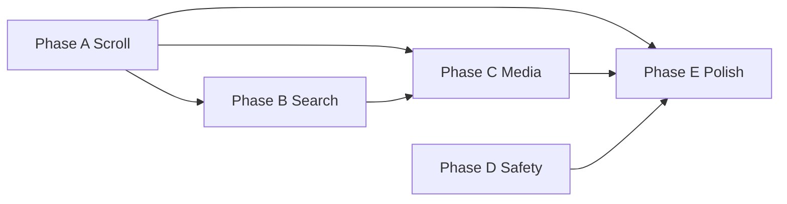

# Chat Messenger parity — design spec (A→E)

**Status:** Approved for phased implementation  
**Date:** 2026-05-16  
**Scope:** Nâng chat UniHub lên UX kiểu Messenger (scroll, search, media, safety, polish)  
**Baseline:** `docs/specs/2026-05-02-chat-realtime-v1-design.md`, `frontend/src/features/chat/*`

---

## 1. Mục tiêu

| Phase | Tên | Kết quả người dùng thấy |
|-------|-----|-------------------------|
| **A** | Scroll UX | Vào thread → ở đáy; tin mới auto-scroll khi đang ở đáy; badge + nút ↓ khi đang đọc cũ; load tin cũ khi kéo lên |
| **B** | Tìm kiếm | Tìm text trong hội thoại, nhảy tới tin; lọc nhanh (tuỳ chọn phase B+) |
| **C** | Media & links | Panel/tab ảnh, file, link đã gửi trong cuộc trò chuyện |
| **D** | Block / mute / báo cáo | Chặn user, tắt tiếng hội thoại, báo cáo tin nhắn |
| **E** | Polish Messenger | Reactions UI, đã xem, reply quote, menu tin, info panel, trạng thái gửi |

Mỗi phase **ship độc lập**, merge được, có checklist test riêng trong `docs/plans/chat-messenger-parity/`.

---

## 2. Ba hướng kiến trúc (đã chọn)

### Scroll (Phase A)

| # | Hướng | Ưu | Nhược |
|---|--------|-----|--------|
| 1 | **Hook `useChatScrollAnchor` + div scroll** ✅ | Khớp code hiện tại, ít rủi ro | List dài (>500 tin) có thể chậm |
| 2 | `react-virtuoso` | Hiệu năng list dài | Refactor lớn, phức tạp scroll-to-bottom |
| 3 | CSS `column-reverse` | Native sticky bottom | Khó load-more phía trên, dễ bug |

**Chọn (1)** cho A; đánh giá lại Virtuoso sau B nếu profile thấy lag.

### Search (Phase B)

| # | Hướng | Ưu | Nhược |
|---|--------|-----|--------|
| 1 | **Server search + PG `ILIKE` / `tsvector`** ✅ | Đúng với history dài, phân trang | Cần API + index |
| 2 | Client-only trên page đã load | Không BE | Sai khi tin ngoài 50 tin đầu |
| 3 | Elasticsearch | Mạnh | Overkill MVP |

**Chọn (1)** với `GET /api/v1/chat/conversations/{id}/messages/search?q=&filter=&page=`.

### Safety (Phase D)

| # | Hướng | Ưu | Nhược |
|---|--------|-----|--------|
| 1 | **Block trong Identity + enforce ở Chat** ✅ | Tái dùng mọi module | 2 bounded context |
| 2 | Chỉ trong Chat | Nhanh | Trùng lặp sau này |

**Chọn (1).** Mute lưu `conversation_participant` hoặc bảng `conversation_preferences` trong Chat.

---

## 3. Kiến trúc FE (sau tất cả phase)

```
features/chat/
├── hooks/
│   ├── useChatScrollAnchor.ts      # A
│   ├── useConversationSearch.ts    # B
│   └── useConversationMediaIndex.ts # C (cache RTK)
├── components/
│   ├── ChatMessageList.tsx         # A — tách từ ChatThread
│   ├── ScrollToBottomFab.tsx       # A
│   ├── ConversationSearchPanel.tsx # B
│   ├── ConversationInfoDrawer.tsx  # C + E
│   ├── MediaLinkTabs.tsx           # C
│   ├── MessageActionsMenu.tsx      # E
│   ├── ReactionPicker.tsx          # E
│   └── ReplyPreviewBar.tsx         # E
└── lib/
    ├── extractLinks.ts             # C
    └── scrollConstants.ts          # A
```

**Nguyên tắc scroll (Messenger):**

- `atBottom` = `scrollHeight - scrollTop - clientHeight < threshold` (48px).
- Mở thread / gửi tin thành công → `scrollToBottom(smooth: false)` lần đầu, `smooth: true` sau.
- Hub `ReceiveMessage` + RTK cache update → nếu `atBottom` thì scroll; không thì `pendingNewCount++`.
- User click FAB → scroll + clear count.
- Scroll tới `scrollTop < 80` → fetch `page+1` (prepend), giữ scroll anchor (đo chiều cao trước/sau).

---

## 4. Kiến trúc BE (phase cần mới)

| Phase | API / domain |
|-------|----------------|
| A | Không bắt buộc (dùng pagination hiện có); optional `before` cursor sau |
| B | `SearchConversationMessagesQuery`, index `GIN` hoặc `ILIKE` trên `content` |
| C | `ListConversationAttachmentsQuery` (mime filter), link = search `filter=links` hoặc parse URL trong content |
| D | `POST/DELETE /api/v1/identity/users/{id}/block`, `POST .../mute`, `POST .../report`; Chat handler kiểm tra block trước send |
| E | Chủ yếu FE; batch mark read khi scroll đáy |

---

## 5. Phụ thuộc giữa phase



- **D** có thể làm song song **B** sau khi **A** xong (không phụ thuộc search).
- **E** nên cuối vì dùng info drawer từ C và scroll từ A.

---

## 6. Ngoài phạm vi (giữ nguyên / deferred)

- E2E encryption
- Chỉnh sửa tin đã gửi UI (API có PATCH — có thể thêm nhỏ trong E)
- Channel search toàn server (chỉ conversation DM/group trong B)
- Waveform voice nâng cao

---

## 7. Tiêu chí hoàn thành (toàn initiative)

- [ ] Dock + `/chat` hành vi scroll giống nhau
- [ ] Tìm được tin từ 6 tháng trước (server search)
- [ ] Xem được grid ảnh/file/link trong thread
- [ ] Block user → không gửi/nhận DM được
- [ ] Reaction + seen + reply hoạt động trên DM
- [ ] `vi` + `en` i18n đầy đủ
- [ ] Test: unit hook scroll + API search + integration block send

---

## 8. Tài liệu triển khai

| File | Nội dung |
|------|----------|
| [README](../plans/chat-messenger-parity/README.md) | Chỉ mục phase, ước lượng, thứ tự |
| [phase-a-scroll-ux.md](../plans/chat-messenger-parity/phase-a-scroll-ux.md) | Plan chi tiết A |
| [phase-b-in-conversation-search.md](../plans/chat-messenger-parity/phase-b-in-conversation-search.md) | Plan B |
| [phase-c-media-and-links.md](../plans/chat-messenger-parity/phase-c-media-and-links.md) | Plan C |
| [phase-d-block-mute-report.md](../plans/chat-messenger-parity/phase-d-block-mute-report.md) | Plan D |
| [phase-e-messenger-polish.md](../plans/chat-messenger-parity/phase-e-messenger-polish.md) | Plan E |

**Sau khi duyệt spec này:** implement lần lượt theo từng file plan; mỗi phase một PR nhỏ.
