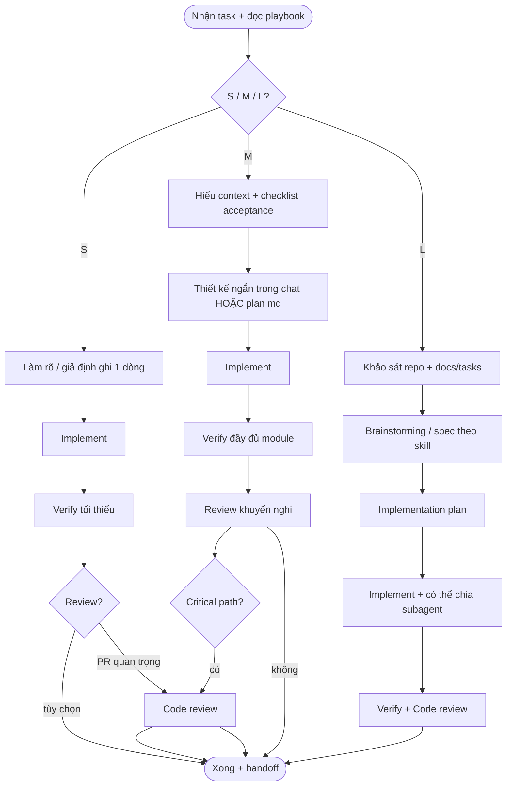

# Agent task playbook — quy trình task nhỏ / vừa / lớn (+ review linh hoạt)

Tài liệu này là **nguồn chân lý** cho agent khi user paste **Prompt khởi động** (mục dưới). Agent **phải đọc file này trước**, chọn nhánh phù hợp cỡ task, rồi mới code.

---

## Prompt khởi động (copy-paste vào chat)

**Tiếng Việt (điền trong ngoặc):**

```text
Đọc và làm theo đúng playbook:
e:\HCMUE-Forum\docs\workflows\agent-task-playbook.md

Task: <mô tả ngắn gọn việc cần làm>
Cỡ task (chọn một): S | M | L | để agent tự ước lượng
Ràng buộc / link tham chiếu (tùy chọn): <đường dẫn file, ticket, PR>

Yêu cầu: chọn nhánh S/M/L theo playbook, thực hiện đủ “cổng” (gates) tương ứng, chạy verify phù hợp stack, tóm tắt kết quả + việc còn lại.
```

**English variant:**

```text
Read and follow strictly:
e:\HCMUE-Forum\docs\workflows\agent-task-playbook.md

Task: <short description>
Size: S | M | L | (let agent estimate)
Refs (optional): <paths, ticket, PR>

Follow the playbook gates for that size; run project verify; summarize outcome and leftovers.
```

---

## 1. Mục đích

- Chuẩn hóa cách làm việc khi task **nhỏ** (fix nhanh), **vừa** (feature cục bộ), **lỏn** (nhiều module / nhiều PR / thay đổi hành vi hệ thống).
- Gắn với các skill có sẵn trong hệ sinh thái Cursor/Superpowers: **brainstorming → spec → writing-plans → implementation → verification → code-review** — nhưng **không áp dụng máy móc** cho mọi bug một dòng.
- **Review linh hoạt:** bắt buộc khi rủi ro cao hoặc trước merge; tùy chọn cho task S sau khi verify xanh.

---

## 2. Phân cỡ task (S / M / L)

| Cỡ | Đặc điểm gợi ý | Ví dụ |
|----|----------------|--------|
| **S — Small** | 1 file hoặc vài dòng; rủi ro thấp; không đổi contract API/DB công khai | typo, rename, fix lint, điều chỉnh CSS một component |
| **M — Medium** | Một feature theo feature-folder; có thể chạm API/types/i18n; 1 PR hợp lý | thêm filter UI + hook + RTK endpoint một module |
| **L — Large** | Nhiều bounded context; migration; auth/security; contract API mới; nhiều màn hình | wave Learning đầy đủ, RTK migration toàn app |

**Nếu user không ghi cỡ:** agent **tự ước lượng** và **nêu một dòng** trong reply đầu tiên: “Task được xếp loại **M** vì …”. Nếu không chắc, hỏi **một câu** duy nhất để phân cỡ.

---

## 3. Sơ đồ quy trình (tổng quát)



---

## 4. Chi tiết theo cỡ

### 4.1 Task S (Small)

1. **Clarify:** Nếu mơ hồ, hỏi tối đa **1 câu**; không bắt brainstorming.
2. **Implement:** đúng scope; không refactor “dạo”.
3. **Verify:** lệnh tối thiểu của stack (vd: `npm run lint`, `npm run verify` nếu đụng FE đã có script — **chạy thật**, không chỉ nói).
4. **Review:** **không bắt buộc**; bắt buộc nếu user yêu cầu hoặc thay đổi security/auth.

**Không** tạo spec file riêng trừ khi user muốn lưu quyết định.

---

### 4.2 Task M (Medium)

1. **Context:** đọc file liên quan (feature folder, `docs/tasks/fe-*.md` nếu có).
2. **Thiết kế ngắn** (trong chat hoặc 5–15 dòng ở đầu PR): boundary component/API, dữ liệu vào/ra, lỗi hiển thị.
3. **Plan:** có thể là checklist trong chat; **hoặc** file plan trong `docs/superpowers/plans/YYYY-MM-DD-<topic>-plan.md` nếu task kéo > 1 phiên.
4. **Implement + Verify:** đủ cho module (lint, typecheck, i18n parity nếu có string).
5. **Review:** **khuyến nghị** trước merge; dùng skill *requesting-code-review* khi task “Major feature” hoặc chạm tiền/auth.

**Brainstorming skill full** chỉ khi có tranh luận UX/kiến trúc chưa rõ — không bắt cho mọi M.

---

### 4.3 Task L (Large)

1. **Khảo sát:** đọc `docs/tasks/`, API docs, router/guards hiện tại.
2. **Brainstorming / Spec:** làm theo skill **brainstorming** — có design + **user approval** trước khi code lớn; ghi spec vào `docs/superpowers/specs/YYYY-MM-DD-<topic>-design.md` (hoặc đường dẫn team quy ước).
3. **Implementation plan:** skill **writing-plans** → plan chi tiết, checkpoints.
4. **Implement:** có thể **chia subagent** theo boundary (api vs ui vs i18n) — **tránh** hai agent sửa cùng file một lúc; merge tuần tự hoặc chia folder rõ.
5. **Verify:** pipeline đầy đủ (`npm run verify`, test BE nếu đụng API).
6. **Code review:** **bắt buộc** trước merge chính (hoặc sau mỗi batch lớn); dùng template skill *requesting-code-review* (BASE/HEAD SHA khi đã commit).

---

## 5. Review linh hoạt — khi nào bắt buộc?

| Tình huống | Review |
|------------|--------|
| Task S, không auth/tiền | Tùy chọn |
| Task M, UI/API công khai | Khuyến nghị |
| Task L hoặc migration | Bắt buộc |
| Trước merge `main` | Khuyến nghị / bắt buộc theo team |
| Thay đổi `userId`/token/security | Bắt buộc + ưu tiên backend |

Agent:** không được** bỏ qua review chỉ vì “đã verify xanh” nếu user trong prompt ghi **“cần review”** hoặc task là **L**.

---

## 6. Verify — không báo xanh khi chưa chạy

Làm theo skill **verification-before-completion** (nếu có trong workspace): **chỉ nói “pass” khi đã chạy lệnh và thấy exit code 0** (trừ khi môi trường không cho phép — phải ghi rõ).

---

## 7. Handoff (cuối mỗi phiên)

Luôn kết thúc bằng block ngắn:

- **Đã làm:** …
- **Verify:** lệnh + kết quả
- **Review:** đã/không/chờ
- **Việc còn lại / nợ kỹ thuật:** …

Để phiên sau hoặc PR reviewer không mất ngữ cảnh.

---

## 8. Liên kết nhanh trong repo

| Nội dung | Gợi ý đường dẫn |
|----------|------------------|
| Task FE theo module | `docs/tasks/fe-*.md` |
| Spec / plan superpowers | `docs/superpowers/specs/`, `docs/superpowers/plans/` |
| Playbook này | `docs/workflows/agent-task-playbook.md` |

Cập nhật bảng trên nếu team dời vị trí tài liệu.

---

## 9. Ghi chú cho agent (tránh lỗi thường gặp)

- **Không** nhét brainstorming full vào task S.
- **Không** bỏ `npm run verify` (FE) khi đụng `src/` chỉ vì “nhỏ”.
- **Một task một paste prompt:** nếu user gộp 5 việc không liên quan, đề xuất **tách task** trước khi làm.
- File playbook là **single source of truth** cho phiên có paste Prompt khởi động; nếu user sửa playbook, phiên sau agent đọc bản mới.

---

*Tệp tạo để paste vào Cursor: user chỉ cần Prompt khởi động + mô tả task; agent mở file này và làm theo nhánh S/M/L.*
